# PKF for assimilation of multivariate chemical atmospheric data

## Introduction

This contribution explores a new approach to forecast multivariate covariances for atmospheric chemistry through the use of the parametric Kalman filter (PKF). In the PKF formalism, the error covariance matrix is modelized by a covariance model relying on parameters, for which the dynamics is then computed. The PKF has been formulated in univariate cases, and a multivariate extension for chemical transport models is explored here. To do so, a simplified two-species chemical transport model over a 1D domain is introduced, based on the nonlinear Lotka-Volterra equations, which allows to propose a multivariate pseudo covariance model. Then, the multivariate PKF dynamics is formulated and its results are compared with a large ensemble Kalman filter (EnKF) in several numerical experiments. In these experiments, the PKF accurately reproduces the EnKF. Eventually, the PKF is formulated for a more complex chemical model composed of six chemical species (Generic Reaction Set). Again, the PKF succeeds at reproducing the multivariate covariances diagnosed on the large ensemble.

This repository provides the numerical codes used for the article

***A. Perrot, O. Pannekoucke, and V. Guidard, “Toward a multivariate formulation of the PKF dynamics : application to a simplified chemical transport model”. egusphere-2022-928***

This work has been supported by the French INSU-LEFE, grant MPKF (multivariate PKF) 

  

## Data assimilation for atmospheric chemistry

Predicting air quality is a major public health issue. At Météo-France, the
prediction of the chemical composition of the atmosphere is carried out using the chemistry model
MOCAGE transport (CTM) developed at the CNRM and whose initial state, called analysis, is estimated at
using a model-specific data assimilation chain.

Data assimilation corresponds to the stage of updating the forecast taking into account the
observations available. This step is based on the formalism of the Kalman filter which describes
the evolution of the first two moments of the distribution characterizing the forecast errors and
of analysis. In this formalism, the covariance matrices play an essential role. But the big one
dimension of this type of problem limits the way of representing the temporal evolution of
statistics. In particular, the forecast error covariance matrix is often modeled as
climatologically with an adaptation of error variances according to the value of
planned fields.

Recently, a new way to solve the Kalman filter equations has been introduced,
in which the error covariance matrices are approximated by a covariance which rely on parameters. In this formalism, describe the temporal evolution of the error covariance matrices during assimilation cycles comes down to describing the time evolution (forecast) and the update (analysis) of these parameters. This novel approach in resolving the Kalman Filter's equations is called the PKF : Parametric Kalman Filter (PKF) (see e.g. [Pannekoucke et al. 2016][Pannekoucke2016T], [Pannekoucke et al. 2018][Pannekoucke2018NPG], [Pannekoucke 2021][Pannekoucke2021T]). This algorithm made it possible to
better understand the way in which observations reveal uncertainty, and
the parametric Kalman filter (PKF) appeared to be a theoretical tool to address
new questions ([Pannekoucke and Arbogast 2021][Pannekoucke2021GMD]). For instance, using the PKF we were able to characterize for the first time
times the model error covariance matrix related to the digital discretization ([Pannekoucke
et al. 2020][Pannekoucke2020NPG]).

Until now, the PKF has been formulated in univariate contexts. To push further the investigation on the PKF, the goal of this work is thus the exploration of a multivariate formulation of the PKF dynamics. To do so, we first need to extand the PKF covariance model to multivariate context, that is, proposing a parameterized modelization of the cross-correlation functions. Then, having determined the PKF multivariate covariance model, being able to describe the time evolution of its parameters.

[Pannekoucke2016T]: https://doi.org/10.3402/tellusa.v68.31547 "O. Pannekoucke, S. Ricci, S. Barthelemy, R. Ménard, and O. Thual, “Parametric Kalman Filter for chemical transport model,” Tellus, vol. 68, p. 31547, 2016, doi: 10.3402/tellusa.v68.31547."

[Pannekoucke2018NPG]: https://doi.org/10.5194/npg-2018-10 "O. Pannekoucke, M. Bocquet, and R. Ménard, “Parametric covariance dynamics for the nonlinear diffusive Burgers’ equation,” Nonlinear Processes in Geophysics, vol. 2018, pp. 1–21, 2018, doi: https://doi.org/10.5194/npg-2018-10."

[Pannekoucke2020NPG]: https://doi.org/10.5194/npg-28-1-2021 "O. Pannekoucke, R. Ménard, M. El Aabaribaoune, and M. Plu, “A methodology to obtain model-error covariances due to the discretization scheme from the parametric Kalman filter perspective,” Nonlinear Processes in Geophysics, vol. 28, no. 1, pp. 1–22, 2021, doi: 10.5194/npg-28-1-2021."

[Pannekoucke2021T]: https://doi.org/10.1080/16000870.2021.1926660 "O. Pannekoucke, “An anisotropic formulation of the parametric Kalman filter assimilation,” Tellus A: Dynamic Meteorology and Oceanography, vol. 73, no. 1, pp. 1–27, Jan. 2021, doi: 10.1080/16000870.2021.1926660."

[Pannekoucke2021GMD]: https://doi.org/10.5194/gmd-14-5957-2021 "O. Pannekoucke and P. Arbogast, “SymPKF (v1.0): a symbolic and computational toolbox for the design of parametric Kalman filter dynamics,” Geoscientific Model Development, vol. 14, no. 10, pp. 5957–5976, Oct. 2021, doi: 10.5194/gmd-14-5957-2021."

## The ensemble Kalman filter (EnKF)
To evaluate how uncertainties evolves with the dynamics, the ensemble Kalman Filter (EnKF) consists in 
the evaluation of a group of samples (called an ensembe) with small perturbations of the initial state. Then, based on
how the trajectories of the samples converges or diverges, we obtain an estimation of the covariance matrix
using the empirical covariance matrix of the ensemble. The bigger the ensemble, the better the estimation.
But when dealing with large-dimension problems, as it is often the case in geophysics, this methods quickly
becomes very costly in terms of numerical computation as well as for storing the covariance matrix.

## The parametric Kalman filter (PKF)
Thus, the interest of the PKF which consists in modeling the dynamics of a small set of parameters (mean flows,
variances, covariances and diffusion tensors) and to estimate the covariance matrix using a covariance model composed
of these parameters. This method only need to evaluate the trajectories of its parameters instead of 1600 of 6400 trajectories
for the EnKF and does not require the storage of a huge covariance matrix.

[__Notebook 1:__](./notebooks/1.%20Introduction%20to%20ensemble%20methods%20(EnKF)%20and%20Parametric%20Kalman%20Filter%20(PKF).ipynb) Introduction to assimilation methods for a simplified chemical model
---------------------

Notebook 1 first introduces a simplified chemical model based on the Lotka-Volterra's equations, which leads to periodical behaviours of the concentrations:

  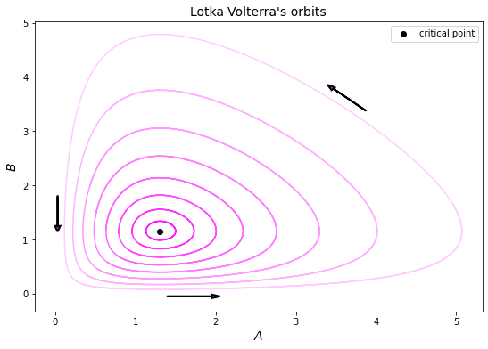

Then, an example introduces the use of assimilation methods to estimate the state of a dynamical system by performing 4 cycles of data assimilation with an ensemble Kalman filter of size 400.

  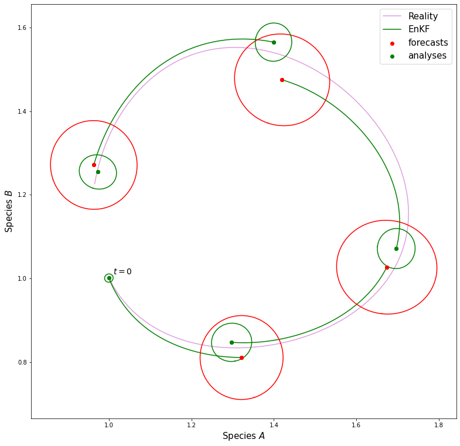

Finally, the PKF is formulated for the simplified chemical model and its performances at forecasting the state system and its error covariance matrix are compared with the results of a large EnKF. 

  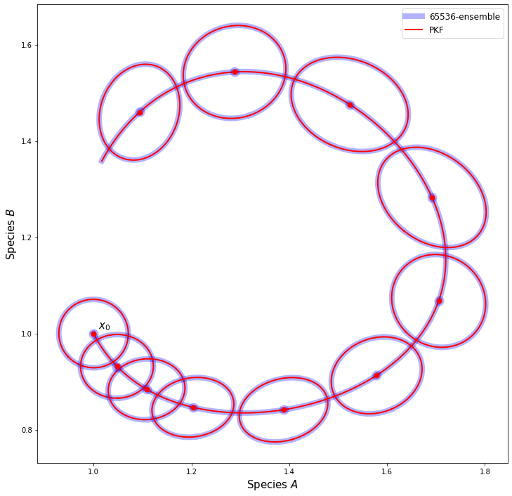

This last example shows that leveraring on the problem equations can significantly reduce the numerical cost and offer a better understanding of the uncertainty dynamics.

[__Notebook 2:__](./notebooks/2.%20Univariate%20advection%20problem.ipynb) The PKF for a univariate advection problem
---------------------

Before moving on to the simplified CTM and to give the reader a good understanding of the PKF applied in spatial contexts, attention is put on an univariate advection problem in 1D. The dynamics of the PKF are computed using the specifically designed Python package SymPKF ([Pannekoucke et al. 2021][Pannekoucke2021GMD], https://github.com/opannekoucke/sympkf).

In the following, several forecasts of the state system with its error statistics are done and the results of the PKF and EnKF are compared. Two different resolutions (*low* and *high*, 241 and 743 grid points) of the spatial grid are used in the EnKF case to put in evidence the sensibility of the error statistics produced by the EnKF to numerical model error, but also to demonstrate the robustness of the PKF method which, by nature, is less subject to this numerical model error.

  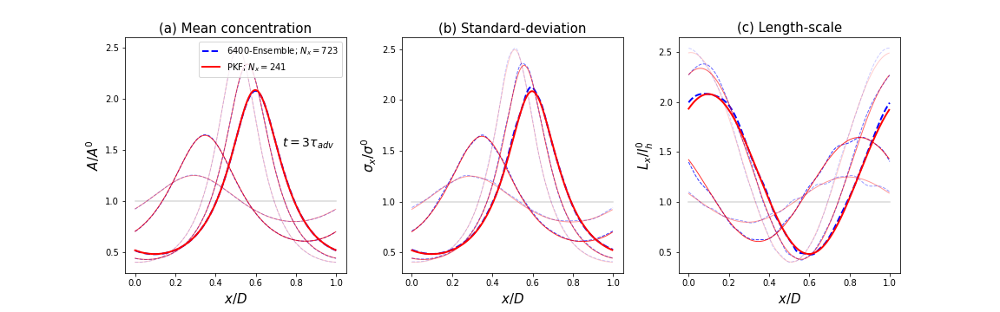

Eventually, the estimations of the correlation function at $x=0.5$ and times $t=\\{0,0.6,1.2,1.8,2.4,3.0\\} \tau_{adv}$ by either the PKF correlation model, EnKF-lowres and EnKF-highres are compared.

  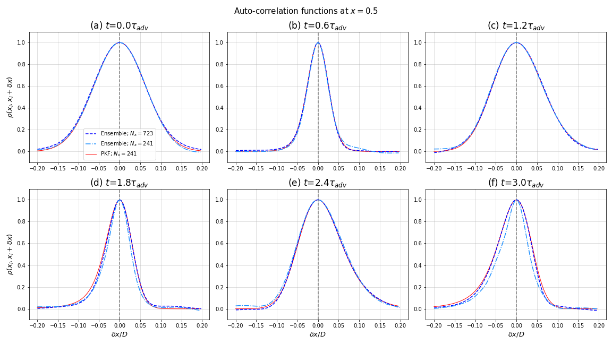

[__Notebook 3:__](./notebooks/3.%20Multivariate%20formulation%20of%20the%20PKF%20for%20a%20simplified%20CTM.ipynb) A multivariate formulation of the PKF : application to a simplified CTM
---------------------
This notebook first presents the simplified CTM, that is the combination the simplified chemical model given by the Lotka-Volterra's equation with a conservative equation for the two chemical species.
Then, a proxy for estimating the cross-correlation is proposed. Several numerical experiments are performed using a large EnKF so to evaluate (qualitatively and quantitatively) its ability to reproduces the empirical cross-correlations given by the EnKF, in different situations.

  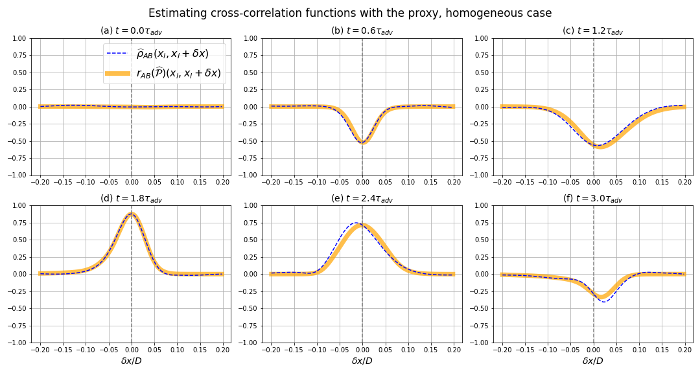

  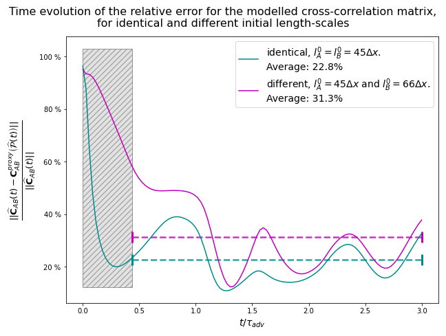

The [SymPKF package](https://github.com/opannekoucke/sympkf) is then used to deduce the PKF dynamics for the simplified CTM. As it appears that the system of equations is not closed (open terms in the anisotropy dynamics), an exhaustive study on the nature and magnitude of the open terms is conducted in the following notebook.

[__Notebook 4:__](./notebooks/4.%20Studying%20the%20anisotropy%20dynamics%20for%20the%20simplified%20chemical%20model.ipynb) Detailed study on the impact of the chemistry alone on the anisotropies
---------------------
As the open terms in the anisotropy dynamics are due to the non-linear coupling term $A \times B$ in the chemical model, we would like to better understand how the chemistry influences the length-scales (or anisotropy) dynamics. To do so, a similar and linear chemical model based on the equations of the Harmonic Oscillator (HO) is introduced so to derive explicit solutions for the temporal evolution of the error statistics under spatially homogeneous hypothesis. Numerical forecasts of the EnKF are carried out, in which the transport process is turned off (windfield is set to zero) to compare the dynamics of the error statistics for Lotka-Volterra with the explicit solutions for the HO.

  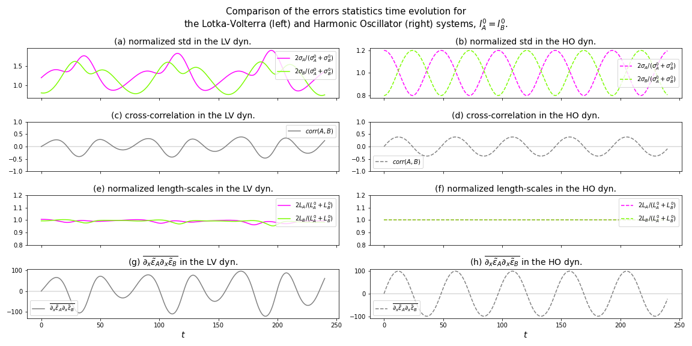

  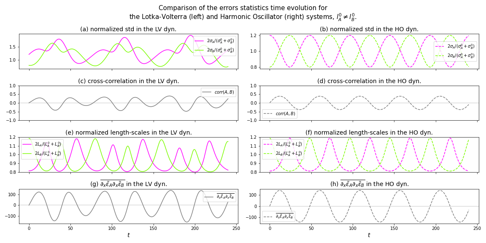

Both empirical measurements with the EnKF and the explicit analytical solutions for HO indicate that identical (resp. different) length-scales for the two chemical species lead to the absence of (resp. the presence of oscillatory) dynamics for the anisotropy.

The following numerical experiment aims to quantify the role of the two processes at play (conservative transport and chemistry) in the complete dynamics of the anisotropy. Using a large EnKF which gives access to the open terms, and relying on the ouputs of the SymPKF for the simplified CTM, an *a posteriori* estimations of the terms present the anisotropy dynamics allows to compute the magnitude of the contribution for the different processes (or term).

  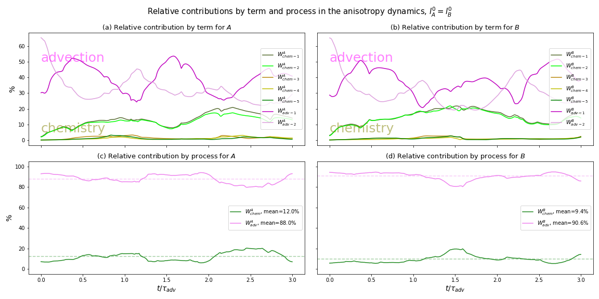

This last experiment let appears that the transport is the most dominant process. Thereafter, we choose to neglect all the chemistry-related terms (including the closed ones) in the anisotropy dynamics so to close the PKF system. 

[__Notebook 5:__](./notebooks/5.%20Multivariate%20PKF%20-%20Forecast%20and%205%20assimilation%20cycles.ipynb) Forecast and complete data assimilation cycles experiments
---------------------
The PKF system being closed, this notebooks presents several numerical experiments to assess the PKF in this multivariate context. Again, a large EnKF serves as a reference. 
Two experiments, forecast and 5 complete assimilation cycles, are performed under two different initial conditions for the length-scales : equal $l^A_0=l^B_0$ and different $l^A_0\neq l^B_0$.

__forecast:__ [(video here)](./figures/video_plots/forecast_Nx723.mp4)

  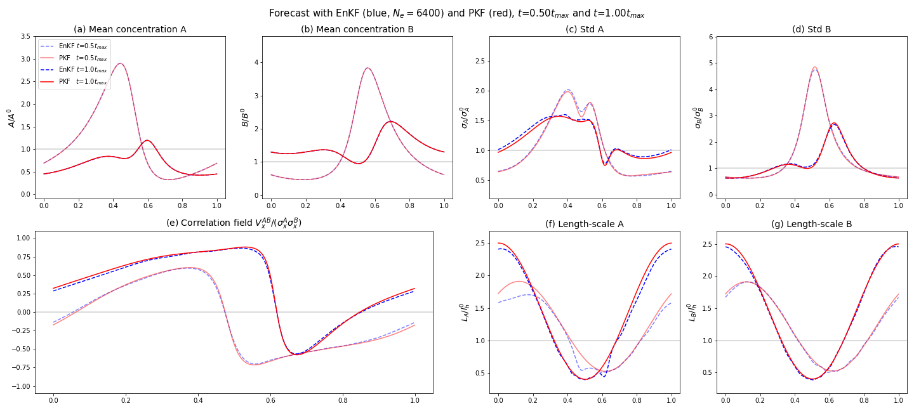

__5 data assimilation cycles:__ [(video here)](./figures/video_plots/data_assimilation_experiment_Nx723.mp4)

  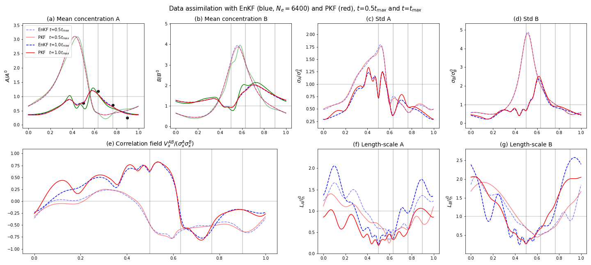

The PKF produces accurate data assimilation cycles at a fraction of the EnKF numerical cost.

[__Notebook 6:__](./notebooks/6.%20Advection%20GRS.ipynb) Further testing of the PKF with the GRS chemical model
---------------------
This last notebook put to the test the PKF in a more complex context with the GRS chemical model (Azzi et al, 1992; Haussaire et Bocquet, 2016) which consists of 6 chemical species, multiple non-linear coupling, emission inventories, ground-deposits and time-varying chemical rates. Again, this chemical model is coupled with a conservative transport process.

A numerical forecast is conducted for a period of 72h, at a low-resolution (241 grid points).

  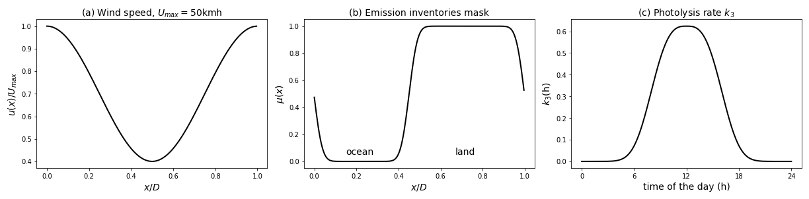

__forecast over 72h:__ [(video here)](./figures/video_plots/GRS_forecast.mp4)

  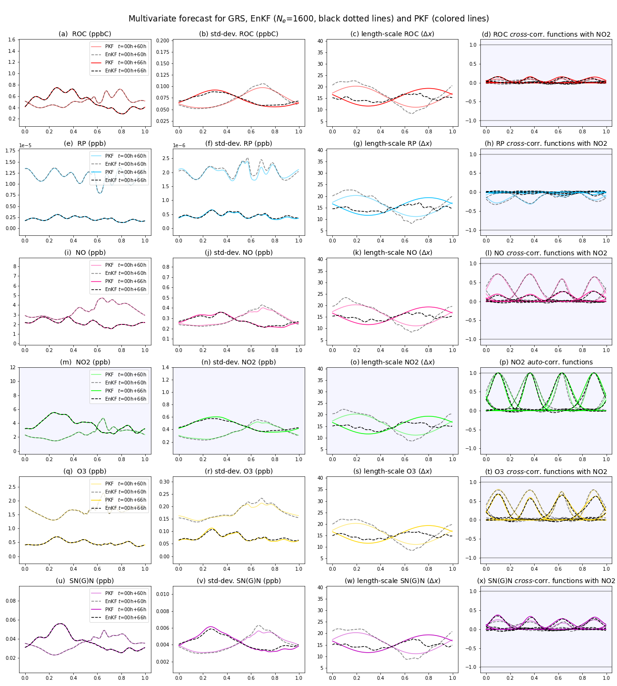

The PKF outputs are of high quality regarding the means and the standard-deviation fields. Slight differences can be observed between PKF and EnKF on the length-scales but are also due to numerical model error in the EnKF diagnosis, as notebook 2 has shown. The last columns show a key result : the good estimations by the proxy of the cross-correlation functions.

### Annexe notebooks :

[__alternative_pkf_formulation_experiments.ipynb:__](./notebooks/annexe_notebooks/alternative_pkf_formulation_experiments.ipynb) in this notebook, an alternative formulation of the PKF is test, the open term $ \overline{\partial_x \tilde{\varepsilon}_A \partial_x \tilde{\varepsilon}_B}$ is estimated by $\frac{V^{AB}_x}{\sigma_x^A \sigma_x^B} \frac{2}{s^A_x+s^B_x}$ (see section 3.3 of the article).

[__computing_grs_dynamics_with_sympkf.ipynb:__](./notebooks/annexe_notebooks/computing_grs_dynamics_with_sympkf.ipynb) in this notebook, we use the SymPKF package to compute the PKF dynamics for the GRS chemical model.

[__modified_equation_for_conservative_transport_equation.ipynb:__](./notebooks/annexe_notebooks/modified_equation_for_conservative_transport_equation.ipynb) in this notebook, we compute the modified equation induced by the use of euler temporal explicit scheme and centered finite differences for a conservative transport equation.

